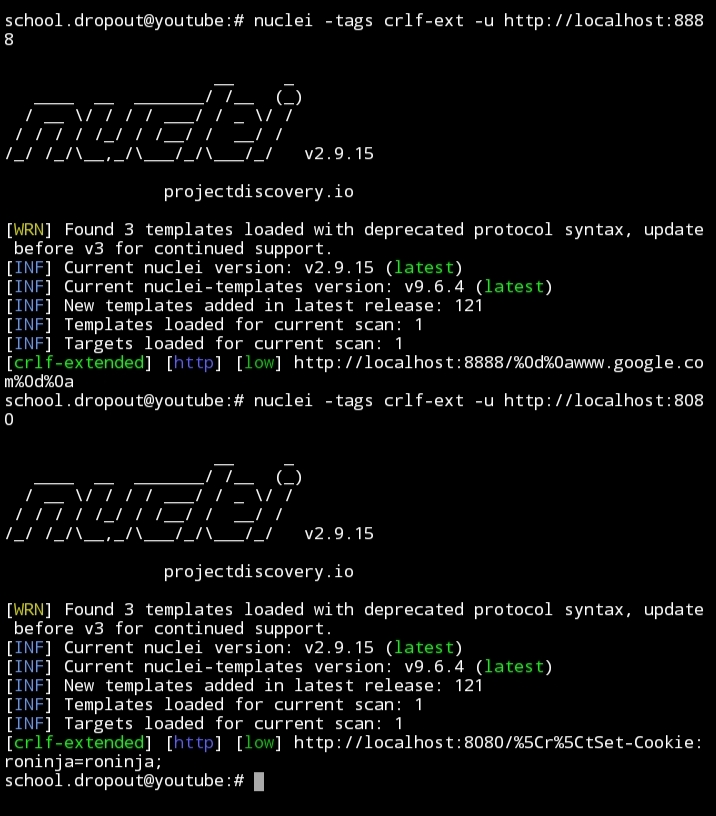

# Nuclei Template: CRLF Injection Detection (crlf-extended)

## Table of Contents

- [Overview](#overview)
- [Template Information](#template-information)
- [References](#references)

---

## Overview

This is a nuclei template designed for detecting CRLF (Carriage Return Line Feed) injection vulnerabilities. CRLF injection vulnerabilities occur when an attacker can manipulate or inject CRLF characters into an application's input, often leading to various security issues such as HTTP response splitting, header injection, or even remote code execution.

This nuclei template is an extended version of the template originally created by [Oralyzer](https://github.com/r0075h3ll/Oralyzer). It's designed to identify instances where CRLF sequences are not properly sanitized or handled by a web application.

---

## Template Information

- **Name:** CRLF Injection Detection (crlf-extended)
- **Author:** roninja
- **Severity:** Low
- **Description:** CRLF extended from Oralyzer
- **Tags:** crlf, extended, security, detection

### Usage

This template can be used with the [Nuclei Scanner](https://github.com/projectdiscovery/nuclei) to scan web applications for CRLF injection vulnerabilities. You can customize the template's HTTP requests and matchers according to your testing needs.




### Example Usage

```bash
nuclei -t crlf-extended.yaml -l targets.txt
```

In the example above, `crlf-extended.yaml` is the name of the nuclei template file, and `targets.txt` contains a list of target URLs or hosts to scan.

---

## References

- [Oralyzer GitHub Repository](https://github.com/r0075h3ll/Oralyzer)

Please note that this template is provided for informational and educational purposes. Ensure you have proper authorization and permissions before using it in a real-world scenario. Use it responsibly and follow ethical hacking practices.

For more information on nuclei and how to use it, refer to the [Nuclei Documentation](https://nuclei.projectdiscovery.io/).
